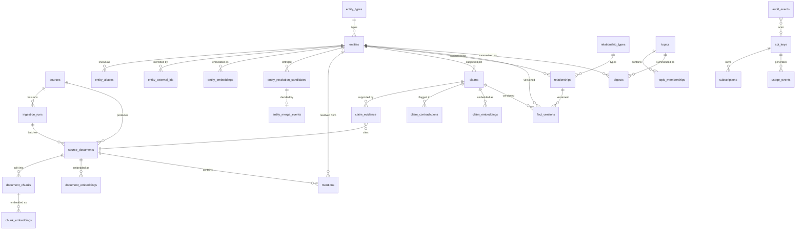

# Data Model

Status: Current — describes `db/migrations/0001` through `0022`
Last updated: 2026-06-04

This document describes the Intercal database schema: table responsibilities, key invariants, and the design decisions behind the bitemporal model, role/office separation, and embeddings architecture.

---

## ER Overview



---

## Bitemporal Model

Intercal supports bitemporal reasoning across `claims`, `relationships`, `fact_versions`, and (optionally) `source_documents`. Two independent time axes are used:

| Axis | Columns | Meaning |
|---|---|---|
| World time | `valid_from`, `valid_until` | When the fact **is or was true in the world**. `valid_until = NULL` means the open interval (still true). |
| System time | `recorded_at` | When Intercal **learned or recorded** the fact. |

These axes are independent. A historical fact (e.g. a relationship that held from 1990–2000) may be recorded today (`recorded_at = now()`). This independence is required for reliable "what did Intercal know as of date X about facts true at date Y?" queries — the core use case for cutoff-gap agents.

### Append-only invariant (`fact_versions`)

The `fact_versions` table is append-only. Corrections never update existing rows; instead:
1. Insert a new row with the corrected payload and updated valid interval.
2. Set `superseded_by_id` on the old row to point at the new one.
3. Set `is_current = false` on the old row.

The superseded row is the historical archive. Never delete it.

---

## Role / Office Separation

Roles and offices are modeled as **separate entity types**, not as aliases for their current holder.

- `entity_types.id = 'role'`: a named position, e.g. "CEO of OpenAI".
- `entity_types.id = 'office'`: a formal institutional post, e.g. "US Secretary of State".

Temporal occupancy is a `relationship` with type `person_holds_role` or `person_holds_office`, with `valid_from` and `valid_until` encoding the term.

This is a hard architectural requirement for historical correctness. Without it:
- Queries for "who held this role in 2020?" cannot be answered.
- Entity merges and corrections would silently rewrite history.
- "Sam Altman" and "CEO of OpenAI" would be confused — they are distinct entities with a dated relationship.

---

## Embeddings: Model, Dim, and Vector-Space Safety

Every embedding table carries `model` (text) and `dim` (integer) columns that identify the **vector space**. These are required — not optional metadata.

The default model is `bge-small-en-v1.5` at 384 dimensions, stored as `halfvec(384)` (pgvector half-precision floats).

**Critical invariant:** Vectors from different models or different dimensions represent incompatible spaces. They must never be mixed in the same HNSW index. If a new model with a different dimension count is adopted, a **new migration must add a new column or table**. The existing `halfvec(384)` column cannot receive 768-dim vectors.

All embedding HNSW indexes use `halfvec_cosine_ops` (cosine similarity):

```sql
CREATE INDEX ON chunk_embeddings USING hnsw (embedding halfvec_cosine_ops);
```

`halfvec` halves index storage vs `vector` (4-byte floats) at no material recall loss for cosine similarity.

---

## Table-by-Table Reference

### Reference / Vocabulary Tables

**`entity_types`** — `db/migrations/0002_entity_types.sql`

Strict reference table for entity type identifiers. Every `entities.type_id` is a FK into this table. The current vocabulary: `person`, `organization`, `place`, `role`, `office`, `product`, `event`, `concept`, `legislation`, `technical_artifact`, `source`, `dataset`, `jurisdiction`. New types require a migration + seed. Free text is never accepted in entity rows.

**`relationship_types`** — `db/migrations/0003_relationship_types.sql`

Strict vocabulary of typed edge identifiers. Every `relationships.type_id` is a FK. Carries `is_exclusive` (boolean) to declare whether at most one active interval per (subject, object) pair should exist — enforced at application layer. See `db/seeds/0002_relationship_types.sql` for the full vocabulary.

---

### Ingestion Pipeline

**`sources`** — `db/migrations/0004_sources.sql`

One row per configured data origin (RSS, API, dump, registry, etc.). Carries adapter config, run cadence, reliability score, rate limit hints, and — critically — the **redistribution / citation-only policy** per source. The `redistribution_allowed` and `citation_only` flags govern what the pipeline may store and expose. Source policy is snapshotted onto `source_documents` at ingest time for immutability.

**`ingestion_runs`** — `db/migrations/0005_ingestion_runs.sql`

Every ingest job creates a run row and updates its status (`pending → running → succeeded | failed | skipped`). Stores outcome counters and a `cursor_state` jsonb for resumable adapters. Idempotency: the pipeline checks for in-progress runs before starting a new one.

---

### Document Layer

**`source_documents`** — `db/migrations/0006_source_documents.sql`

Immutable evidence units. Key invariant: `content_hash` (SHA-256 hex of the normalized cleaned body) is `UNIQUE` — the deduplication anchor. Once inserted, a document row must not be mutated. Both `published_at` (source time) and `ingested_at` (system time) are stored. Raw content lives in object storage (`raw_storage_key`); `cleaned_text` is the extraction-ready normalized copy.

**`document_chunks`** — `db/migrations/0007_document_chunks.sql`

Sub-document spans produced by the chunking step. Each chunk is the atomic unit for embedding and retrieval. `chunk_index` is 0-based and unique per document.

---

### Entity Graph

**`entities`** — `db/migrations/0008_entities.sql`

Canonical things. `type_id` FK-enforced. Carries `current_state` jsonb (denormalized snapshot) and merge/deprecation metadata (`is_deprecated`, `merged_into_id`, `deprecated_at`). Queries over the live graph should filter `WHERE is_deprecated = false`. The historical record for entity state lives in `fact_versions`.

**`entity_aliases`** — `db/migrations/0009_entity_aliases.sql`

Alternative names, abbreviations, and former names. Used for mention matching and search disambiguation. Unique per `(entity_id, lower(alias), language)`.

**`entity_external_ids`** — `db/migrations/0010_entity_external_ids.sql`

Stable identifiers from external authority systems (Wikidata QID, ORCID, LEI, GitHub org, DOI, ROR, etc.). The primary high-confidence input for entity resolution. Unique per `(entity_id, namespace, external_id)`.

**`entity_resolution_candidates`** — `db/migrations/0011_entity_resolution.sql`

Auditable candidate pairs with proposed decisions (`merge`, `keep_separate`, `needs_review`), matching/negative signals, confidence, and evidence document IDs. `left_entity_id < right_entity_id` (UUID ordering) prevents duplicate pairs. Conservative default: `needs_review`. False merges are data corruption; false non-merges are acceptable.

**`entity_merge_events`** — `db/migrations/0011_entity_resolution.sql`

Append-only log of every merge execution. Stores pre-merge JSON snapshots of both entities and the lists of moved alias/external-ID rows — sufficient to fully reverse any merge. `source_entity_id` = loser (set deprecated); `target_entity_id` = winner.

---

### Extraction Layer

**`mentions`** — `db/migrations/0012_mentions.sql`

Text spans extracted from documents that appear to refer to an entity. Mentions are **evidence candidates, not canonical records**. `entity_id` is set only after the resolution pipeline confirms the link. This separation prevents weak extraction from polluting canonical entity records.

---

### Claims

**`claims`** — `db/migrations/0013_claims.sql`

First-class atomic factual assertions. The most important primitive. Carries:
- Structured subject/predicate/object (with entity FKs where resolved, and plain text for unresolved subjects)
- `qualifiers` jsonb for additional context
- Bitemporal `valid_from` / `valid_until`
- `extraction_confidence` and `extractor` identifier
- `contradiction_status` and `status` lifecycle (`active`, `superseded`, `retracted`, `draft`)
- `normalized_text` (canonical restatement)
- `raw_quote` / `raw_spans` (nullable for redistribution-restricted sources)

Every claim surfaced publicly must have at least one row in `claim_evidence`.

**`claim_evidence`** — `db/migrations/0013_claims.sql`

Join table linking claims to their supporting `source_documents`. `ON DELETE RESTRICT` on `document_id` prevents orphaned evidence. Carries `support_strength` (`supports`, `partially_supports`, `contradicts`, `neutral`) and an optional span pointer.

**`claim_contradictions`** — `db/migrations/0013_claims.sql`

Pairs of claims asserting incompatible facts. `claim_a_id < claim_b_id` (UUID ordering) prevents duplicate pairs. Drives confidence reduction and review queues.

---

### Relationships

**`relationships`** — `db/migrations/0014_relationships.sql`

Typed temporal edges between canonical entities, derived from claims. `type_id` is FK-enforced against `relationship_types`. Carries bitemporal `valid_from` / `valid_until` / `recorded_at`, `confidence`, and denormalized `source_document_ids` / `claim_ids`. `properties` jsonb holds type-specific attributes (e.g. title for `person_holds_role`, deal value for acquisitions). Overlap exclusivity for exclusive types is enforced at the application layer (see `relationship_types.is_exclusive`).

---

### Fact History

**`fact_versions`** — `db/migrations/0015_fact_versions.sql`

Append-only bitemporal history. Covers entities, relationships, and claims (via `fact_subject_type` + `fact_subject_id`). Carries `valid_from` / `valid_until` (world time), `recorded_at` (system time), `payload` jsonb snapshot, `confidence`, and `superseded_by_id`. Never update or delete rows. `is_current = false` rows are the historical archive.

---

### Embeddings

**`document_embeddings`**, **`chunk_embeddings`**, **`entity_embeddings`**, **`claim_embeddings`** — `db/migrations/0016_embeddings.sql`

Four separate tables, one per owner type. Each carries `model` (text), `dim` (int), `embedding` (`halfvec(384)`), and `created_at`. HNSW index on each `embedding` column using `halfvec_cosine_ops`. Unique per `(owner_id, model)` to support multi-model scenarios.

---

### Topics and Digests

**`topics`** — `db/migrations/0017_topics.sql`

Named query surfaces (user-defined, system-derived, or materialized). Not canonical facts — convenient views for digest generation and subscriptions. Carry `freshness_score` updated by the pipeline.

**`topic_memberships`** — `db/migrations/0017_topics.sql`

Polymorphic join table linking topics to entities, claims, documents, or relationships. `member_type` + `member_id` are validated at application layer.

**`digests`** — `db/migrations/0018_digests.sql`

Cached agent-facing syntheses. Delivery artifacts only — never used as evidence or canonical facts. Store `source_document_ids` + `claim_ids` + `fact_version_ids` for staleness detection and citation verification. `is_stale` is set by the pipeline when underlying facts change.

---

### Subscriptions

**`subscriptions`** — `db/migrations/0019_subscriptions.sql`

Interest registrations for the W5 public REST target set: entities, topics, relationship types, or claim patterns. The legacy `source_id` column is present in the table but is not exposed by the W5 public contract. At least one target must be set. Owned by `api_keys` and gated by the `manage:subscriptions` scope. `webhook_secret_hash` stores only create-time webhook-delivery secret hashes — never the plaintext value, and webhook responses never echo secrets.

**`subscription_notifications` / `subscription_delivery_logs`** — `db/migrations/0029_subscription_notifications.sql`

Bounded notification outbox plus delivery-attempt ledger. Notification payloads are built from the public delta contract shape and carry changed claim IDs, changed entity summaries, confidence, freshness, citations, and the token-budgeted digest summary. They are not internal row snapshots. Polling delivery marks pending polling notifications delivered and writes a delivery log; webhook delivery is driven through a provider port with retry/backoff state and per-attempt logs.

---

### Security and Operations

**`api_keys`** — `db/migrations/0020_api_keys.sql`

API key records. Only the SHA-256 hash of the raw key is stored (`key_hash UNIQUE`). The raw key is shown to the user exactly once at creation. `scopes` is a jsonb array of scope strings (e.g. `["read:entities", "read:claims"]`). `revoked_at` is the authoritative revocation timestamp — revoked keys must be rejected regardless of `is_active`. Rate limit hints are stored here and enforced at the API layer.

**`usage_events`** — `db/migrations/0021_usage_events.sql`

Operational records of API and MCP tool calls. Used for rate limiting, billing, and analytics. Not a security audit log. `ip_address` should be anonymized per privacy policy.

**`audit_events`** — `db/migrations/0022_audit_events.sql` (append-only enforced by `0026_audit_events_append_only.sql` + `0027_audit_events_forbid_truncate.sql`)

Append-only security and data-quality audit log — the trust ledger of who did what to trust-sensitive state. Captures actor, action, target, before/after state snapshots, and rationale for: entity merges and reversals, claim corrections and retractions, source submissions, key operations (issue/revoke), admin actions, and entity resolution decisions. `severity` levels: `info`, `low`, `medium`, `high`, `critical`. The append-only invariant is enforced in the database: migration 0026 rejects row-level `UPDATE`/`DELETE`, and migration 0027 rejects statement-level `TRUNCATE`, so history cannot be silently rewritten or erased through the data path. Emission is centralized in `@intercal/core` (`recordAuditEvent` / `recordAuditEventStrict`); the key lifecycle (`issueApiKey`/`revokeApiKey`) writes its audit row in the same transaction as the mutation. No secret values are ever written (the emit helper also redacts secret-bearing keys defensively). See `docs/security/audit-events.md`.

---

## Key Invariants Summary

| Invariant | Location | Enforcement |
|---|---|---|
| Unique document content hash | `source_documents.content_hash UNIQUE` | DB constraint |
| No entity type as free text | `entities.type_id REFERENCES entity_types` | DB FK |
| No relationship type as free text | `relationships.type_id REFERENCES relationship_types` | DB FK |
| Append-only fact versions | `fact_versions` | Application policy + comments |
| Reversible entity merges | `entity_merge_events` with snapshots | Application logic |
| Every public claim has evidence | `claim_evidence` with `ON DELETE RESTRICT` on `document_id` | Application policy |
| Embeddings carry model + dim | `model NOT NULL`, `dim NOT NULL` on all embedding tables | DB constraint |
| Different-dim model = new column/table | Convention documented in SQL comments | Code review |
| API keys store only hash | `key_hash NOT NULL UNIQUE`; no plaintext column | Schema design |
| Audit events are append-only | `audit_events` | DB triggers (migrations 0026/0027) reject UPDATE/DELETE/TRUNCATE |
| Role/office ≠ person alias | Separate entity types + typed relationships | Schema design |
