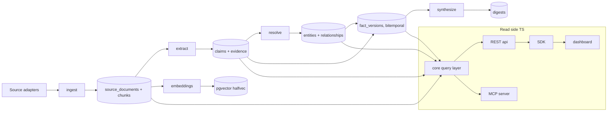

# System Map

Package and service ownership, and how data flows. The live code is the source of truth; this
doc explains boundaries.

## Runtimes

- **Python** (`uv` workspace) — the pipeline: ingestion, extraction/claim modeling, entity
  resolution, embeddings, synthesis. Owns writes to Postgres.
- **TypeScript** (`pnpm` workspace) — the agent/human-facing surface: contracts, query layer,
  REST API, MCP server, SDK, dashboard. Read-side.
- **Postgres + pgvector** — the single canonical store. Redis/queue and S3 storage are
  supporting concerns behind adapters, never canonical.

## TypeScript packages (`packages/*`)

| Package | Owns |
| --- | --- |
| `@intercal/shared` | Contracts. **TypeSpec is the single source**; OpenAPI 3.1 + JSON Schema + TS types are generated. Exposes `getOpenApiDocument()`, `getJsonSchema()`, and `V1_TOOLS`. |
| `@intercal/core` | Shared DB access (Kysely, read-side) + the **query-service layer** (`getEntity`, `getSources`, `getFreshness`, `searchEvidence`, `getDelta`, `verifyClaim`). One set of query semantics. |
| `@intercal/api` | Hono REST API. Validates query params against the generated JSON Schema (ajv) and serves `/openapi.json`. Deploy-agnostic (Node/Vercel/Cloudflare/Bun). |
| `@intercal/mcp-server` | MCP server (official SDK). Streamable HTTP (`http.ts`) primary, stdio (`stdio.ts`) for local. Tool input schemas **are** the generated JSON Schemas. |
| `@intercal/sdk` | Typed REST client; types come from the contract, no separate semantics. |
| `@intercal/dashboard` | Next.js read-only knowledge experience; consumes the SDK server-side. |

> Note: `@intercal/core` is an intentional addition to the foundation report's package list —
> the report scoped a "shared query service layer" without naming a package. API and MCP both
> depend on `core` so query semantics live in exactly one place.

## Python services (`services/*`)

| Package (import) | Owns |
| --- | --- |
| `intercal-shared` (`intercal_shared`) | Config, the asyncpg pool + repositories, the **adapter ports** (storage, embeddings, llm, queue, scheduler) and their default adapters, the adapter `factory`, and the generated Pydantic `contracts`. |
| `intercal-ingest` | `ingest_source`, `normalize_document`, `score_source_health`, `cleanup_expired_cache`. |
| `intercal-extract` | `extract_mentions`, `extract_claims`. |
| `intercal-resolve` | `resolve_entities`, `derive_relationships`, `write_fact_versions`. |
| `intercal-synthesize` | `build_digest`, `recompute_freshness`, `notify_subscribers`. |

Each service exposes a `python -m intercal_<name> <job>` CLI — the portable worker entrypoint
(local / GitHub Actions / Modal / cron). Pipeline algorithm bodies are Plan-02 scope and are
marked `NotImplementedError("Plan 02 — …")`, never faked.

## Data flow

Writes flow Python → Postgres through repositories. Reads flow Postgres → `core` → API/MCP →
SDK → dashboard. The contract (`@intercal/shared`) and the schema (`db/`) are the two
load-bearing boundaries; everything else is swappable behind a port.
